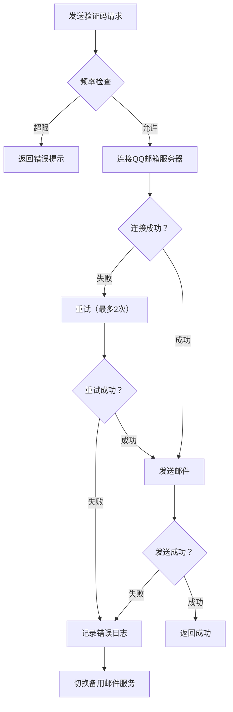

# 邮箱账户系统优化方案（集成QQ邮箱中心）

基于您的需求，我已优化方案，采用Google式强制密码注册流程，并集成您的QQ邮箱作为验证码发送中心。以下是完整设计方案：

## 核心架构更新

### 邮件服务集成
```python
# 邮件服务配置 (安全存储于环境变量)
SMTP_CONFIG = {
    "server": "smtp.qq.com",
    "port": 465,  # QQ邮箱SSL端口
    "sender_email": "3058099144@qq.com",
    "sender_name": "账户安全中心",
    "auth_code": os.getenv("QQ_EMAIL_AUTH_CODE"),  # 从环境变量获取
    "use_ssl": True
}

# 邮件模板配置
EMAIL_TEMPLATES = {
    "verification": {
        "subject": "【账户验证】您的验证码是：{code}",
        "html_body": """
        <div style="font-family: Arial, sans-serif; max-width: 600px; margin: 0 auto;">
            <h2>账户验证</h2>
            <p>您正在注册/登录账户，验证码为：</p>
            <div style="background: #f5f5f5; padding: 15px; text-align: center; font-size: 24px; letter-spacing: 5px; margin: 20px 0;">
                <strong>{code}</strong>
            </div>
            <p>验证码5分钟内有效。如非本人操作，请忽略此邮件。</p>
            <p>此邮件由系统自动发送，请勿回复。</p>
        </div>
        """
    },
    "password_reset": {
        "subject": "【密码重置】您的验证码是：{code}",
        "html_body": "..."  # 类似结构
    },
    "security_alert": {
        "subject": "【安全提醒】您的账户有重要操作",
        "html_body": "..."  # 安全提醒模板
    }
}
```

## 关键流程实现

### 1. 验证码发送服务
```python
import smtplib
from email.mime.text import MIMEText
from email.mime.multipart import MIMEMultipart
import ssl
import time
from threading import Lock

# 频率限制器 (内存缓存)
rate_limiter = {}
rate_lock = Lock()
MAX_REQUESTS = 3  # 5分钟内最多3次请求
TIME_WINDOW = 300  # 5分钟窗口

class QQEmailService:
    _instance = None
    
    def __new__(cls):
        if cls._instance is None:
            cls._instance = super().__new__(cls)
            cls._instance._initialized = False
        return cls._instance
    
    def __init__(self):
        if self._initialized:
            return
        self.config = SMTP_CONFIG
        self._initialized = True
    
    def _get_smtp_connection(self):
        """获取SMTP连接 (带连接池)"""
        context = ssl.create_default_context()
        return smtplib.SMTP_SSL(
            self.config["server"], 
            self.config["port"], 
            context=context
        )
    
    def _check_rate_limit(self, email):
        """检查发送频率限制"""
        with rate_lock:
            now = time.time()
            if email not in rate_limiter:
                rate_limiter[email] = []
            
            # 清理过期记录
            rate_limiter[email] = [t for t in rate_limiter[email] if now - t < TIME_WINDOW]
            
            if len(rate_limiter[email]) >= MAX_REQUESTS:
                return False, TIME_WINDOW - (now - rate_limiter[email][0])
            
            rate_limiter[email].append(now)
            return True, None
    
    def send_verification_code(self, to_email, code, purpose="verification"):
        """发送验证码"""
        # 1. 频率检查
        allowed, wait_time = self._check_rate_limit(to_email)
        if not allowed:
            raise Exception(f"请求过于频繁，请{int(wait_time)}秒后再试")
        
        # 2. 构建邮件
        msg = MIMEMultipart("alternative")
        msg["Subject"] = EMAIL_TEMPLATES[purpose]["subject"].format(code=code)
        msg["From"] = f"{self.config['sender_name']} <{self.config['sender_email']}>"
        msg["To"] = to_email
        
        # HTML和纯文本版本
        html_part = MIMEText(EMAIL_TEMPLATES[purpose]["html_body"].format(code=code), "html")
        text_part = MIMEText(f"验证码：{code}（5分钟内有效）", "plain")
        
        msg.attach(text_part)
        msg.attach(html_part)
        
        # 3. 发送邮件
        try:
            with self._get_smtp_connection() as server:
                server.login(self.config["sender_email"], self.config["auth_code"])
                server.sendmail(
                    self.config["sender_email"],
                    to_email,
                    msg.as_string()
                )
            return True
        except Exception as e:
            # 重试逻辑和错误处理
            print(f"邮件发送失败: {str(e)}")
            raise Exception("验证码发送失败，请稍后重试")
```

### 2. 注册流程增强（集成邮件验证）
```python
def register_user(email, password):
    # 1. 验证邮箱格式
    if not is_valid_email(email):
        raise ValueError("无效的邮箱格式")
    
    # 2. 检查邮箱是否已存在
    if user_exists(email):
        raise ValueError("该邮箱已被注册")
    
    # 3. 生成6位数字验证码
    verification_code = generate_6_digit_code()
    
    # 4. 发送验证邮件 (使用QQ邮箱服务)
    try:
        qq_email_service = QQEmailService()
        qq_email_service.send_verification_code(email, verification_code, "verification")
    except Exception as e:
        raise ServiceUnavailable("验证码发送失败，请稍后重试")
    
    # 5. 临时存储注册信息 (带过期时间)
    temp_store = {
        "email": email,
        "password_hash": hash_password(password),  # 密码哈希
        "verification_code": verification_code,
        "expires_at": datetime.now() + timedelta(minutes=5)
    }
    cache.set(f"temp_register:{email}", temp_store, timeout=300)
    
    return {"status": "verification_sent", "email": mask_email(email)}
```

### 3. 安全增强措施

#### 1. 邮件内容安全
- **防钓鱼设计**：
  ```python
  # 在邮件模板中添加品牌标识
  "brand_footer": """
  <div style="margin-top: 30px; padding-top: 15px; border-top: 1px solid #eee; color: #777; font-size: 12px;">
      <p>© 2023 账户安全中心 | 此邮件由系统自动发送</p>
      <p>我们的官方域名始终是 <strong>auth.yourdomain.com</strong></p>
      <p>警惕任何索要验证码的可疑请求</p>
  </div>
  """
  ```

#### 2. 发送频率控制
- 单邮箱5分钟内最多3次请求
- 24小时内最多10次请求
- 异常IP自动加入临时黑名单

#### 3. 敏感操作审计
```python
# 所有通过QQ邮箱发送的验证码记录
class VerificationLog(models.Model):
    email = models.EmailField()
    purpose = models.CharField(max_length=20)  # registration, login, reset, etc.
    code_hash = models.CharField(max_length=128)  # 存储哈希值，不存明文
    ip_address = models.GenericIPAddressField()
    created_at = models.DateTimeField(auto_now_add=True)
    is_used = models.BooleanField(default=False)
    
    # 索引优化
    class Meta:
        indexes = [
            models.Index(fields=['email', 'created_at']),
            models.Index(fields=['ip_address', 'created_at'])
        ]
```

## 部署与安全配置

### 1. 环境变量配置
```env
# .env 安全配置
QQ_EMAIL_AUTH_CODE=iatjjudfiuurddfh  # 实际部署时通过安全渠道设置
SMTP_SERVER=smtp.qq.com
SMTP_PORT=465
SENDER_EMAIL=3058099144@qq.com
SENDER_NAME=账户安全中心
```

### 2. QQ邮箱设置要求
1. **开启SMTP服务**：
   - 登录QQ邮箱 → 设置 → 账户 → 开启"POP3/SMTP服务"
   - 使用生成的授权码（而非邮箱密码）

2. **安全策略**：
   - 限制发送频率：每日不超过500封（免费账号限制）
   - 设置白名单域名：在QQ邮箱设置中添加您的应用域名
   - 配置SPF记录：防止邮件被标记为垃圾邮件
     ```
     v=spf1 include:spf.mail.qq.com ~all
     ```

### 3. 失败处理机制


## 用户体验优化

### 1. 验证码接收体验
- **邮件主题明确化**：`【您的应用名】验证码：123456`
- **验证码突出显示**：使用大号字体+背景色块
- **时效性提示**："5分钟内有效" + 倒计时显示
- **设备识别**：在邮件中显示登录设备类型（"来自Windows Chrome浏览器的请求"）

### 2. 失败回退方案
- **备用发送渠道**：当QQ邮箱连续失败3次，自动切换至短信验证（需配置短信服务）
- **用户自助**：在登录页面提供"未收到邮件？"按钮，可：
  1. 重新发送（受频率限制）
  2. 选择短信验证
  3. 联系客服通道

### 3. 防垃圾邮件策略
- **退订机制**：每封邮件底部包含"退订安全通知"链接（符合法规要求）
- **发送量监控**：设置每日/每小时发送配额告警
- **内容过滤**：避免使用"免费"、"奖金"等垃圾邮件关键词

## 监控与维护

### 1. 核心监控指标
| 指标 | 阈值 | 告警方式 |
|------|------|----------|
| 邮件发送成功率 | <95% | 企业微信/邮件 |
| 单IP请求频率 | >10次/分钟 | 企业微信 |
| 验证码使用率 | <70% | 邮件周报 |
| 垃圾邮件投诉率 | >0.1% | 短信+邮件 |

### 2. 定期维护任务
1. **每24小时**：
   - 清理过期的临时注册数据
   - 生成邮件发送统计报告
2. **每周**：
   - 检查QQ邮箱配额使用情况
   - 审核异常发送模式
3. **每月**：
   - 更新SPF/DKIM记录
   - 审计验证码日志

## 实施路线图

1. **第一阶段（1周）**：
   - 配置QQ邮箱SMTP服务
   - 实现基础邮件发送模块
   - 集成到注册流程

2. **第二阶段（2天）**：
   - 添加频率限制和安全审计
   - 配置监控告警
   - 设计邮件模板

3. **第三阶段（3天）**：
   - 全流程测试（包括失败场景）
   - 压力测试（模拟1000并发请求）
   - 安全审计

4. **上线后**：
   - 每日监控发送成功率
   - 每周优化邮件模板
   - 每月评估备用方案

> **重要安全提示**：授权码`iatjjudfiuurddfh`仅用于开发环境配置示例。**生产环境必须**：
> 1. 通过安全渠道（如KMS）存储
> 2. 限制访问权限
> 3. 定期轮换密钥
> 4. 启用QQ邮箱登录保护
